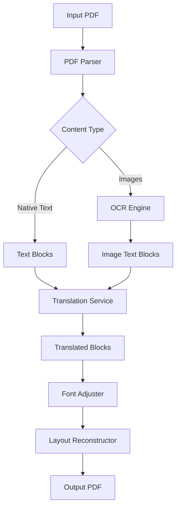

# Design Document: Document Translator

## Overview

This document describes the architecture and design for a layout-preserving PDF document translator. The system extracts text from PDFs (both native text and OCR from images), translates via Gemini API with batch processing, and reconstructs the PDF with translated content while maintaining the original layout. The system is optimized for GPU execution.

## Architecture

The system follows a pipeline architecture with distinct processing stages:



### High-Level Data Flow

1. **Extraction Phase**: PDF_Parser extracts native text blocks and images with layout metadata
2. **OCR Phase**: OCR_Engine processes images to extract embedded text with positions
3. **Translation Phase**: Translation_Service batches text and calls Gemini API
4. **Reconstruction Phase**: Layout_Reconstructor rebuilds PDF with Font_Adjuster handling text fitting

## Components and Interfaces

### 1. PDF_Parser

Responsible for extracting content from PDF documents using PyMuPDF.

```python
class TextBlock:
    text: str
    bbox: Tuple[float, float, float, float]  # (x0, y0, x1, y1)
    font_name: str
    font_size: float
    page_number: int
    is_from_image: bool = False
    image_index: Optional[int] = None

class ImageRegion:
    image_data: bytes
    bbox: Tuple[float, float, float, float]
    page_number: int
    index: int

class PageContent:
    page_number: int
    width: float
    height: float
    text_blocks: List[TextBlock]
    image_regions: List[ImageRegion]
    raw_elements: List[Any]  # Non-text elements to preserve

class PDFParser:
    def parse(self, pdf_path: str) -> List[PageContent]:
        """Extract all content from PDF with layout information."""
        pass
    
    def validate_pdf(self, pdf_path: str) -> Tuple[bool, Optional[str]]:
        """Validate PDF file and return (is_valid, error_message)."""
        pass
```

### 2. OCR_Engine

Handles text extraction from images using PaddleOCR with GPU support.

```python
class OCRResult:
    text: str
    bbox: Tuple[float, float, float, float]  # Relative to image
    confidence: float

class OCREngine:
    def __init__(self, use_gpu: bool = True):
        """Initialize PaddleOCR with GPU configuration."""
        pass
    
    def extract_text(self, image_data: bytes) -> List[OCRResult]:
        """Extract text from a single image."""
        pass
    
    def extract_text_batch(self, images: List[bytes]) -> List[List[OCRResult]]:
        """Extract text from multiple images in batch."""
        pass
    
    def is_gpu_available(self) -> bool:
        """Check if GPU is available for processing."""
        pass
```

### 3. Translation_Service

Manages translation via Gemini API with batch processing and retry logic.

```python
class TranslationRequest:
    text: str
    source_lang: Optional[str]
    target_lang: str
    block_id: str  # For tracking

class TranslationResult:
    original_text: str
    translated_text: str
    block_id: str
    success: bool
    error_message: Optional[str]

class TranslationService:
    def __init__(self, api_key: str, target_lang: str):
        """Initialize with Gemini API credentials."""
        pass
    
    def translate_batch(self, requests: List[TranslationRequest]) -> List[TranslationResult]:
        """Translate multiple text blocks in batched API calls."""
        pass
    
    def _call_gemini_api(self, texts: List[str], target_lang: str) -> List[str]:
        """Internal method to call Gemini API with retry logic."""
        pass
```

### 4. Font_Adjuster

Calculates appropriate font sizes to fit translated text in original boxes.

```python
class FontAdjustment:
    original_font_size: float
    adjusted_font_size: float
    font_name: str
    line_breaks: List[int]  # Character positions for line breaks
    is_truncated: bool

class FontAdjuster:
    MIN_FONT_SIZE: float = 6.0
    
    def calculate_fit(
        self, 
        text: str, 
        bbox: Tuple[float, float, float, float],
        original_font_name: str,
        original_font_size: float
    ) -> FontAdjustment:
        """Calculate font size and line breaks to fit text in bbox."""
        pass
    
    def measure_text(self, text: str, font_name: str, font_size: float) -> Tuple[float, float]:
        """Measure text dimensions (width, height) for given font settings."""
        pass
```

### 5. Layout_Reconstructor

Rebuilds the PDF with translated content while preserving layout.

```python
class ReconstructedBlock:
    translated_text: str
    bbox: Tuple[float, float, float, float]
    font_adjustment: FontAdjustment
    page_number: int
    is_image_overlay: bool

class LayoutReconstructor:
    def __init__(self, original_pdf_path: str):
        """Initialize with original PDF for structure reference."""
        pass
    
    def reconstruct(
        self, 
        pages: List[PageContent],
        translated_blocks: List[ReconstructedBlock]
    ) -> bytes:
        """Reconstruct PDF with translated content."""
        pass
    
    def save(self, output_path: str) -> None:
        """Save reconstructed PDF to file."""
        pass
```

### 6. Document_Translator (Orchestrator)

Main entry point that coordinates the entire pipeline.

```python
class TranslationConfig:
    target_language: str
    source_language: Optional[str]
    use_gpu: bool
    batch_size: int
    gemini_api_key: str

class TranslationSummary:
    input_file: str
    output_file: str
    pages_processed: int
    text_blocks_translated: int
    images_processed: int
    errors: List[str]
    processing_time_seconds: float

class DocumentTranslator:
    def __init__(self, config: TranslationConfig):
        """Initialize translator with configuration."""
        pass
    
    def translate_document(self, input_path: str, output_path: str) -> TranslationSummary:
        """Translate a single PDF document."""
        pass
    
    def translate_batch(self, input_output_pairs: List[Tuple[str, str]]) -> List[TranslationSummary]:
        """Translate multiple PDF documents."""
        pass
```

## Data Models

### Core Data Structures

```python
from dataclasses import dataclass
from typing import List, Tuple, Optional, Any
from enum import Enum

class ContentType(Enum):
    NATIVE_TEXT = "native_text"
    IMAGE_TEXT = "image_text"
    IMAGE = "image"
    GRAPHIC = "graphic"

@dataclass
class BoundingBox:
    x0: float
    y0: float
    x1: float
    y1: float
    
    @property
    def width(self) -> float:
        return self.x1 - self.x0
    
    @property
    def height(self) -> float:
        return self.y1 - self.y0
    
    def contains(self, other: 'BoundingBox') -> bool:
        return (self.x0 <= other.x0 and self.y0 <= other.y0 and
                self.x1 >= other.x1 and self.y1 >= other.y1)

@dataclass
class FontInfo:
    name: str
    size: float
    color: Tuple[int, int, int]  # RGB
    is_bold: bool
    is_italic: bool

@dataclass
class TranslationUnit:
    id: str
    original_text: str
    translated_text: Optional[str]
    bbox: BoundingBox
    font_info: FontInfo
    page_number: int
    content_type: ContentType
    parent_image_index: Optional[int]  # For image-embedded text
```

### Serialization Format

For intermediate processing and caching:

```python
@dataclass
class DocumentState:
    """Serializable state for checkpointing large document processing."""
    input_path: str
    pages: List[PageContent]
    translation_units: List[TranslationUnit]
    completed_translations: Dict[str, str]  # unit_id -> translated_text
    current_page: int
    
    def to_json(self) -> str:
        """Serialize state to JSON for persistence."""
        pass
    
    @classmethod
    def from_json(cls, json_str: str) -> 'DocumentState':
        """Deserialize state from JSON."""
        pass
```

## Correctness Properties

*A property is a characteristic or behavior that should hold true across all valid executions of a system—essentially, a formal statement about what the system should do. Properties serve as the bridge between human-readable specifications and machine-verifiable correctness guarantees.*

### Property 1: PDF Extraction Completeness

*For any* valid PDF document, the PDF_Parser shall extract all text blocks and images such that no content is lost, and each extracted element includes correct bounding box coordinates, font information (for text), and position metadata.

**Validates: Requirements 1.1, 1.2**

### Property 2: Extraction Order Preservation

*For any* PDF document with multiple text blocks or pages, the extracted content shall maintain the original reading order within pages and sequential page numbering across the document.

**Validates: Requirements 1.3, 1.4**

### Property 3: Invalid PDF Error Handling

*For any* invalid or corrupted PDF file, the PDF_Parser shall return an error result with a descriptive message rather than crashing or returning partial/incorrect data.

**Validates: Requirements 1.5**

### Property 4: OCR Text Extraction with Positioning

*For any* image containing text, the OCR_Engine shall extract the text content along with bounding box coordinates that accurately represent the text position within the image.

**Validates: Requirements 2.1, 2.2**

### Property 5: OCR Orientation and Order Preservation

*For any* image with text in various orientations, the OCR_Engine shall preserve the detected text's orientation and maintain logical reading order in the results.

**Validates: Requirements 2.4**

### Property 6: OCR Batch Processing Equivalence

*For any* set of images, processing them in batch shall produce identical results to processing each image individually—the batching optimization shall not affect extraction accuracy.

**Validates: Requirements 2.6**

### Property 7: Translation Batch Equivalence

*For any* set of text blocks, translating them in a single batch call shall produce identical results to translating each block individually—batching shall not affect translation quality.

**Validates: Requirements 3.2, 6.2**

### Property 8: Translation Formatting Preservation

*For any* text containing formatting markers or special characters, the Translation_Service shall preserve these markers in the translated output where semantically appropriate.

**Validates: Requirements 3.3**

### Property 9: Translation Retry and Fallback

*For any* API error during translation, the Translation_Service shall retry up to 3 times with exponential backoff, and if all retries fail, shall return the original text with an error flag rather than failing completely.

**Validates: Requirements 3.5, 3.6**

### Property 10: Layout Coordinate Preservation

*For any* text block (native or from OCR), the Layout_Reconstructor shall place the translated text at the exact same coordinates as the original text, maintaining spatial positioning.

**Validates: Requirements 4.1, 4.2**

### Property 11: Non-Text Element Preservation

*For any* PDF containing non-text elements (images, graphics, borders), the Layout_Reconstructor shall preserve these elements in their original positions without modification.

**Validates: Requirements 4.3**

### Property 12: Font Adjustment Text Fitting

*For any* translated text and its target bounding box, the Font_Adjuster shall calculate a font size such that the rendered text (with appropriate line breaks) fits entirely within the box's width and height constraints.

**Validates: Requirements 4.4, 4.5, 7.1, 7.2, 7.3**

### Property 13: Minimum Font Size Invariant

*For any* font adjustment operation, the resulting font size shall never be less than 6pt. If text cannot fit at 6pt, it shall be truncated with ellipsis.

**Validates: Requirements 4.6, 7.5**

### Property 14: Page Dimension Preservation

*For any* reconstructed page, the output page dimensions and margins shall exactly match the original document's page dimensions and margins.

**Validates: Requirements 4.7**

### Property 15: Processing Summary Accuracy

*For any* document translation operation, the returned summary shall accurately reflect the number of pages processed, text blocks translated, images processed, and any errors encountered.

**Validates: Requirements 6.4**


## Error Handling

### Error Categories

| Category | Examples | Handling Strategy |
|----------|----------|-------------------|
| Input Validation | Invalid PDF, corrupted file, unsupported format | Return descriptive error, abort processing |
| OCR Failures | Unreadable image, timeout | Log warning, skip image text, continue |
| API Errors | Rate limit, network timeout, auth failure | Retry with exponential backoff (3 attempts) |
| Translation Failures | API rejection, invalid response | Return original text with error flag |
| Font Fitting | Text too long for minimum font | Truncate with ellipsis, log warning |
| Resource Errors | GPU OOM, disk full | Fallback to CPU / abort with clear message |

### Error Response Structure

```python
@dataclass
class ProcessingError:
    error_type: str
    message: str
    page_number: Optional[int]
    block_id: Optional[str]
    recoverable: bool
    
class ErrorHandler:
    def handle_pdf_error(self, error: Exception, path: str) -> ProcessingError:
        """Handle PDF parsing errors."""
        pass
    
    def handle_ocr_error(self, error: Exception, image_index: int) -> ProcessingError:
        """Handle OCR processing errors."""
        pass
    
    def handle_translation_error(self, error: Exception, block_id: str) -> ProcessingError:
        """Handle translation API errors."""
        pass
```

### Retry Configuration

```python
RETRY_CONFIG = {
    "max_retries": 3,
    "initial_delay_seconds": 1.0,
    "exponential_base": 2.0,
    "max_delay_seconds": 30.0,
    "retryable_errors": [
        "RateLimitError",
        "TimeoutError", 
        "ConnectionError"
    ]
}
```

## Testing Strategy

### Dual Testing Approach

The system requires both unit tests and property-based tests for comprehensive coverage:

- **Unit tests**: Verify specific examples, edge cases, and error conditions
- **Property tests**: Verify universal properties across randomly generated inputs

### Property-Based Testing Framework

**Framework**: `hypothesis` (Python)

**Configuration**:
- Minimum 100 iterations per property test
- Custom strategies for generating PDFs, images with text, and translation scenarios

### Test Categories

#### 1. PDF Parser Tests

**Unit Tests**:
- Parse single-page PDF with known content
- Parse multi-page PDF
- Handle password-protected PDF (error case)
- Handle corrupted PDF (error case)

**Property Tests**:
- Property 1: Extraction completeness
- Property 2: Order preservation
- Property 3: Invalid PDF handling

#### 2. OCR Engine Tests

**Unit Tests**:
- Extract text from image with clear text
- Handle image with no text
- Handle rotated text

**Property Tests**:
- Property 4: Text extraction with positioning
- Property 5: Orientation preservation
- Property 6: Batch equivalence

#### 3. Translation Service Tests

**Unit Tests**:
- Translate single text block
- Handle API timeout
- Handle rate limiting

**Property Tests**:
- Property 7: Batch equivalence
- Property 8: Formatting preservation
- Property 9: Retry and fallback

#### 4. Font Adjuster Tests

**Unit Tests**:
- Fit short text (no adjustment needed)
- Fit long text (reduction needed)
- Handle extreme case (truncation)

**Property Tests**:
- Property 12: Text fitting
- Property 13: Minimum font invariant

#### 5. Layout Reconstructor Tests

**Unit Tests**:
- Reconstruct single page
- Reconstruct page with images
- Preserve graphics and borders

**Property Tests**:
- Property 10: Coordinate preservation
- Property 11: Non-text element preservation
- Property 14: Page dimension preservation

#### 6. Integration Tests

**Unit Tests**:
- End-to-end translation of simple PDF
- End-to-end translation of PDF with images
- Batch processing of multiple PDFs

**Property Tests**:
- Property 15: Processing summary accuracy

### Test Data Generation Strategies

```python
from hypothesis import strategies as st

# Strategy for generating text blocks
text_block_strategy = st.builds(
    TextBlock,
    text=st.text(min_size=1, max_size=500),
    bbox=st.tuples(
        st.floats(0, 500),
        st.floats(0, 700),
        st.floats(50, 550),
        st.floats(50, 750)
    ).filter(lambda b: b[2] > b[0] and b[3] > b[1]),
    font_size=st.floats(6, 72),
    page_number=st.integers(0, 100)
)

# Strategy for generating bounding boxes
bbox_strategy = st.builds(
    BoundingBox,
    x0=st.floats(0, 400),
    y0=st.floats(0, 600),
    x1=st.floats(100, 500),
    y1=st.floats(100, 700)
).filter(lambda b: b.width > 10 and b.height > 10)
```

### Mocking Strategy

For external dependencies:
- **Gemini API**: Mock responses for deterministic testing
- **PaddleOCR**: Use pre-generated OCR results for unit tests, real engine for integration
- **File System**: Use temporary directories for PDF I/O tests

### Test Annotations

Each property test must include:
```python
# Feature: document-translator, Property 12: Font Adjustment Text Fitting
# Validates: Requirements 4.4, 4.5, 7.1, 7.2, 7.3
@given(text=st.text(min_size=1), bbox=bbox_strategy)
def test_font_adjustment_fits_text(text, bbox):
    ...
```
